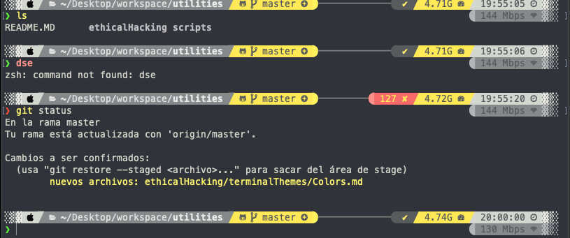
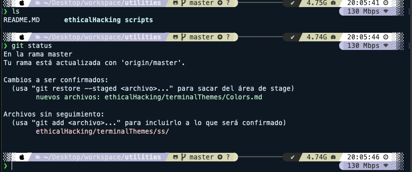
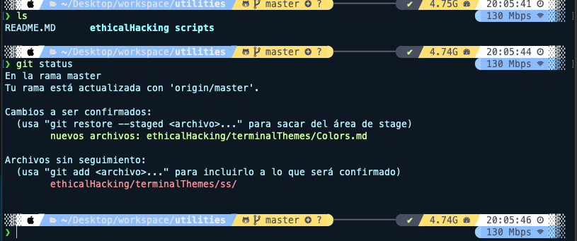
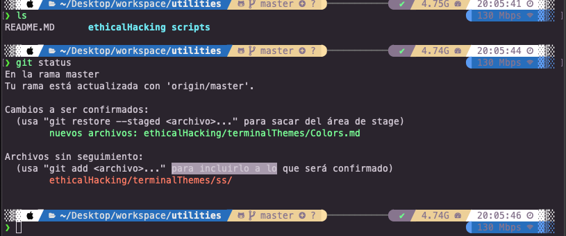
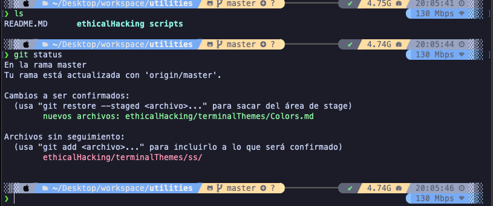

# Terminal Colors

## Theme 1
  
<p> Background: #373A42 <span style="background-color:#373A42;width:14px;height:14px;display:inline-block;border-radius:10%;border:1px solid #ffffff"></span></p>

<p> Text: #D9DAD0 <span style="background-color:#D9DAD0;width:14px;height:14px;display:inline-block;border-radius:10%;border:1px solid #ffffff"></span></p>

<p> Black: #3F3F3F <span style="background-color:#3F3F3F;width:14px;height:14px;display:inline-block;border-radius:10%;border:1px solid #ffffff"></span></p>

<p> Red: #FF9599 <span style="background-color:#FF9599;width:14px;height:14px;display:inline-block;border-radius:10%;border:1px solid #ffffff"></span></p>

<p> Green: #99FF95 <span style="background-color:#99FF95;width:14px;height:14px;display:inline-block;border-radius:10%;border:1px solid #ffffff"></span></p>

<p> Yellow: #FFFB95 <span style="background-color:#FFFB95;width:14px;height:14px;display:inline-block;border-radius:10%;border:1px solid #ffffff"></span></p>

<p> Blue: #9599FF <span style="background-color:#9599FF;width:14px;height:14px;display:inline-block;border-radius:10%;border:1px solid #ffffff"></span></p>

<p> Magenta: #FB95FF <span style="background-color:#FB95FF;width:14px;height:14px;display:inline-block;border-radius:10%;border:1px solid #ffffff"></span></p>

<p> Cian: #95FFFB <span style="background-color:#95FFFB;width:14px;height:14px;display:inline-block;border-radius:10%;border:1px solid #ffffff"></span></p>

<p> White: #FFFFFF <span style="background-color:#FFFFFF;width:14px;height:14px;display:inline-block;border-radius:10%;border:1px solid #ffffff"></span></p>

## Theme 2

```json
{
  "name": "Batman",
  "black": "#1b1d1e",
  "red": "#e6dc44",
  "green": "#c8be46",
  "yellow": "#f4fd22",
  "blue": "#737174",
  "purple": "#747271",
  "cyan": "#62605f",
  "white": "#c6c5bf",
  "brightBlack": "#505354",
  "brightRed": "#fff78e",
  "brightGreen": "#fff27d",
  "brightYellow": "#feed6c",
  "brightBlue": "#919495",
  "brightPurple": "#9a9a9d",
  "brightCyan": "#a3a3a6",
  "brightWhite": "#dadbd6",
  "background": "#1b1d1e",
  "foreground": "#6f6f6f",
  "selectionBackground": "#4d504c",
  "cursorColor": "#fcef0c"
}
```

## Theme 3


```json
{
  "name": "Blazer",
  "black": "#000000",
  "red": "#b87a7a",
  "green": "#7ab87a",
  "yellow": "#b8b87a",
  "blue": "#7a7ab8",
  "purple": "#b87ab8",
  "cyan": "#7ab8b8",
  "white": "#d9d9d9",
  "brightBlack": "#262626",
  "brightRed": "#dbbdbd",
  "brightGreen": "#bddbbd",
  "brightYellow": "#dbdbbd",
  "brightBlue": "#bdbddb",
  "brightPurple": "#dbbddb",
  "brightCyan": "#bddbdb",
  "brightWhite": "#ffffff",
  "background": "#0d1926",
  "foreground": "#d9e6f2",
  "selectionBackground": "#c1ddff",
  "cursorColor": "#d9e6f2"
}
```

## Theme 4

```json
{
  "name": "BlueDolphin",
  "black": "#292d3e",
  "red": "#ff8288",
  "green": "#b4e88d",
  "yellow": "#f4d69f",
  "blue": "#82aaff",
  "purple": "#e9c1ff",
  "cyan": "#89ebff",
  "white": "#d0d0d0",
  "brightBlack": "#434758",
  "brightRed": "#ff8b92",
  "brightGreen": "#ddffa7",
  "brightYellow": "#ffe585",
  "brightBlue": "#9cc4ff",
  "brightPurple": "#ddb0f6",
  "brightCyan": "#a3f7ff",
  "brightWhite": "#ffffff",
  "background": "#0D1926",
  "foreground": "#c5f2ff",
  "selectionBackground": "#2baeca",
  "cursorColor": "#ffcc00"
}
```

## Theme 5

```json
{
  "name": "Calamity",
  "black": "#2f2833",
  "red": "#fc644d",
  "green": "#a5f69c",
  "yellow": "#e9d7a5",
  "blue": "#3b79c7",
  "purple": "#f92672",
  "cyan": "#74d3de",
  "white": "#d5ced9",
  "brightBlack": "#7e6c88",
  "brightRed": "#fc644d",
  "brightGreen": "#a5f69c",
  "brightYellow": "#e9d7a5",
  "brightBlue": "#3b79c7",
  "brightPurple": "#f92672",
  "brightCyan": "#74d3de",
  "brightWhite": "#ffffff",
  "background": "#2f2833",
  "foreground": "#d5ced9",
  "selectionBackground": "#7e6c88",
  "cursorColor": "#d5ced9"
}
```

## Theme 6

```json
{
  "name": "catppuccin-mocha",
  "black": "#45475a",
  "red": "#f38ba8",
  "green": "#a6e3a1",
  "yellow": "#f9e2af",
  "blue": "#89b4fa",
  "purple": "#f5c2e7",
  "cyan": "#94e2d5",
  "white": "#bac2de",
  "brightBlack": "#585b70",
  "brightRed": "#f38ba8",
  "brightGreen": "#a6e3a1",
  "brightYellow": "#f9e2af",
  "brightBlue": "#89b4fa",
  "brightPurple": "#f5c2e7",
  "brightCyan": "#94e2d5",
  "brightWhite": "#a6adc8",
  "background": "#1e1e2e",
  "foreground": "#cdd6f4",
  "selectionBackground": "#585b70",
  "cursorColor": "#f5e0dc"
}
```

## Theme 7

```json
{
  "name": "CutiePro",
  "black": "#000000",
  "red": "#f56e7f",
  "green": "#bec975",
  "yellow": "#f58669",
  "blue": "#42d9c5",
  "purple": "#d286b7",
  "cyan": "#37cb8a",
  "white": "#d5c3c3",
  "brightBlack": "#88847f",
  "brightRed": "#e5a1a3",
  "brightGreen": "#e8d6a7",
  "brightYellow": "#f1bb79",
  "brightBlue": "#80c5de",
  "brightPurple": "#b294bb",
  "brightCyan": "#9dccbb",
  "brightWhite": "#ffffff",
  "background": "#181818",
  "foreground": "#d5d0c9",
  "selectionBackground": "#363636",
  "cursorColor": "#efc4cd"
}
```